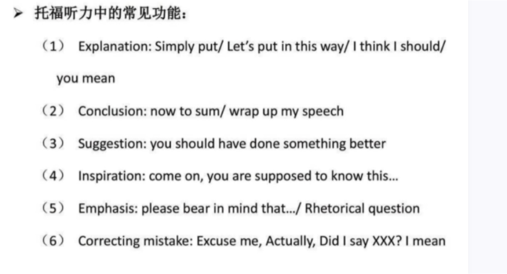
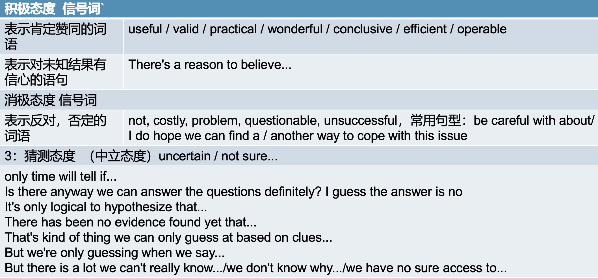
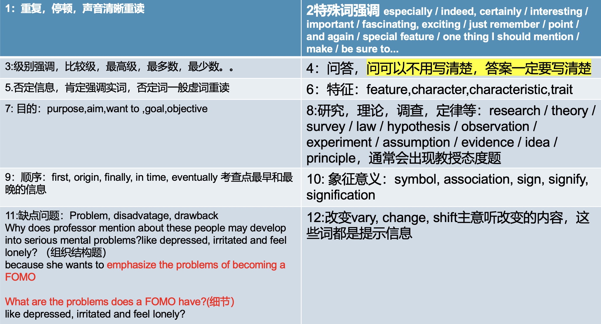

# 目的主旨题

答案为：当下的｜此时此刻的｜目前的直接目的

微观出题，不用二次处理信息

Why does somebody do/say something?

信号词：What’ s up? How can I help you? 

I’ m looking for/I want to / I plan to / I need to / I am wondering if / I’ d like to find

 

# 内容主旨题（F）：

出现的四个特征：开头/重复最多的内容/例子，经历，背景知识（第一段）然后引出主题/特殊位置⚠️

What is the conversation mainly about?

What do the two speakers mainly discuss?

特例：What are the two purposes in the lecture?
 把一个讲座分为完全不同的两个部分，也是内容主旨

内容主旨有时和目的主旨相同

讲座的内容主旨题和目的主旨一定不同，很少出现目的主旨。

信号词：

We will talk about

The topic for today is 

Now let’ s look at

 

# 细节题：

实事求是，不无中生有，不过度推断，可以同义替换

According to the professor, what cause the discoloration of tree leaves?

一个对象多个属性要把属性记全

共同点：what, how, why, when

信号词：专业名词重复出现，术语

### 术语细节题：

术语细节题永远伴随定义，只有一个定义层次，定义不管，记全属性

A is / A refer to / A means / A is well explained in this way 

is called A / named A / which is themed A

记术语，优缺点，应用影响 重点记录名词形容词动词，NVN

术语记全：

​	定义

​	特征，优缺点，

​	影响，属性（A BC and/or D，but后）

​	强调（stands for, identify, highlight, point out）

​	Additionally Plus

# 功能题：

一句话/一件事，不是表面意思或目的，而是背后隐藏的目的才是答案

微观出题，一句话，二次处理背后信息，一对一识别特点

**某人为什么要说某句话或某件事，说话人说或者提及某件事背后的目的**

Um, I don't know., I'm not sure, 

Hold on, are you sure this is right?

Well, wait, just a second（纠错，对你的话有补充，回到主题，Clarify yourself）

Let me see, Let me think about it

# 态度题：

think, consider或者语气

宏观&微观出题

How does the student feel at the end of the conversation?
How does the students' attitude change during the conversation?

What is the woman's attitude toward..

What is the professor' s opinion of ...

关键词：attitude, points of view, opinion, idea, react to

信号词：

​	I think..in my opinion...As I concerned... / There's a reason to believe... / personally I feel , / I strongly believe, / I’m of opinion that, /  if you ask me ... /  to the best of my knowledge... / in my experience, /  as far as I ‘m concerned, /  As far as I know... / To my mind.. /  For me..

Positive words:

​	interesting, impressed, useful, wonderful, excited, valid, like, conclusive, amused, want, practical, operable

Negative words:

​	annoyed, concerned, upset, doubtful, problem

# 组织结构题

出现新信息的时候易出现

总结A信息和B信息在段与段或者句与句之间是10种关系的哪种关系

微观&宏观出题，二次处理

Why does the professor mention MRI?

Why does the professor ask student about their earlier memories?

与另一个逻辑关系存在10种组织结构作用，

信号词：

​	1.出现提问

​	2.出现举例子/ 常见现象

​	3.出现在一个新话题的开头

#### 主题层次结构1:主题/论点

宏观出题

主题只写在开头，其他地方不是，用So,Therefore, Thus引出主题，文章开头的核心实词要记

Why does professor mention about FOMO

Because she wants to introduce the new topic that she is about to discuss.

#### 主题层次结构2：定义

微观出题，术语细节题

Why does the professor mention about the FOMO?
Because she wants to give definition for the ..

#### 主题层次结构3:举例

对话和讲座中，具体说明解释和提供证明，解释抽象概念，为了证明某个客观事实的存在或不存在。

讲座中，引起兴趣，引出主题的作用

宏观&微观

信号词：for instance,such as..., namely...as an exmaple,take example for, say, consider, take...

Why does professor mention about these people

Because she wants to give examples to help student better understand what is FOMO.

#### 主题层次结构4:强调

微观出题，强调什么细节就是什么

#### 主题层次结构5:对比

宏观&微观

我们不能把A和B混淆 We should not confuse A and B

A和B是不同的 A is different from B

首先，我们先区分一下A和B First,let's make a clear distinction between A and B

类似的信号词：Compare to / contrast / unlike / similar to / in contrast to / differently / differ / alike / resemble / on the other hand / instead / likewise / in the same way

Why does professor mention about JOMO？

She wants to make a contrast with FOMO.

#### 主题层次结构6:列举

宏观&微观，两个以上才叫列举

只要出现数字，基本上都是列举

Why does professor mention about the salary?

because he wants to list out how he allocate his money.

#### 主题层次结构7：因果

原因和结果写下来

信号词：

原因：because, because of, due to, since, as, for,the reason is, that's why, owing to

结果：so, so that, therefore, thereby, hereby, thus, as a result, consequently, hence.accordingly

Why does professor mention about the reasons for unemployment?

Because she wants to tell us the consequences of the unemployment may lead into.

#### 主题层次结构8:转折

除了but之外的信号词

but, however, nevertheless, while, yet, unless, except for, actually,in fact, to tell you the truth, practically, virtually, as a matter of fact. well.although.

#### 主题层次结构9：过程

信号词：development, formation, process, procedure, method, approach. evolution

出题：

Why does professor mention about the cycle of the rain?

because she wants to tell us the formation of the rain.

#### 主题层次结构10:结论S

信号词：conclusion,summarize,make a summary, in brief,in short,in a word,in a conclusion,finally,all in all,to sum up.

出题：

Why does professor mention about the prospectives for the future at the end of the conversation?

because she wants to  give a conclusion for the topic.

# 推断题

What does the professor  imply about X?

​    What can be  inferred about X?

​    What  will the student probably  do next?

本质：依据事实细节进一步做逻辑推理，并且Conclusion 才是推断题的答案

# 表格题

如果通篇讲一个主题，分几方面讲这个主题的属性，那这篇文章就很容易出是否类的表格题