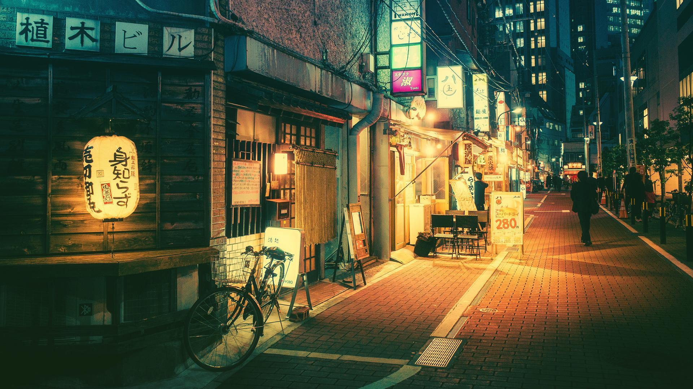

　 [[Greetings, Brave Aficionados!|Back]]

# Currently 🚩L9 N1、頑張れ！
# [[N3文法|🌚N3文法]]　[[N2文法|😶‍🌫️N2文法]]　[[N1文法|🤯N1文法]]　[[🤮副詞]]

# [[👺困り果てる連語]]　[[💳外来語]]　[[🫤接続詞]]
# [[🇯🇵速記名詞]]　[[🤮音讀単語]]　[[🎩自他動詞]]
# [[🤬訓讀詞]]　[[🧑‍🦼文脈規定]]　
# [[👹訓讀音讀同詞]]　
